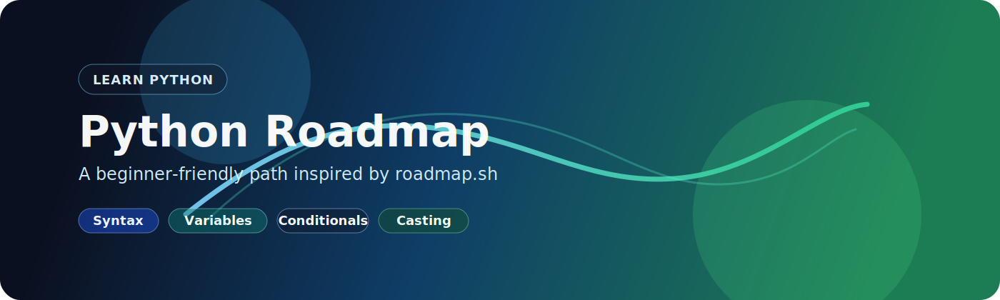

# Learn Python Roadmap



[](https://www.python.org/)
[](https://roadmap.sh/python)
[](#lessons)
[]()

This repository is a beginner-friendly Python learning path built from the [roadmap.sh Python roadmap](https://roadmap.sh/python). It turns the roadmap into eight short lessons with examples, explanations, and practice-ready notes.

The goal is simple: learn Python step by step, build confidence with the core basics, and keep every lesson small enough to study in one sitting.

## What You Will Learn

- Python syntax and how code is executed
- Variables and core data types
- Conditionals and decision making
- Type casting and input handling
- Exceptions and error handling
- Functions, parameters, and built-in functions
- Loops, `break`, `continue`, and nested repetition
- Lists, tuples, and sets

## Lessons

| Lesson | Topic | Format |
| --- | --- | --- |
| 1 | [Basic Syntax](lesson1/readme.md) | Markdown guide |
| 2 | [Variables and Data Types](lesson2/readme.md) | Markdown guide |
| 3 | [Conditionals](lesson3/readme.md) | Jupyter notebook + notes |
| 4 | [Type Casting](lesson4/readme.md) | Markdown guide |
| 5 | [Exceptions](lesson5/readme.md) | Markdown guide |
| 6 | [Functions & Built-in Functions](lesson6/readme.md) | Markdown guide + notebook |
| 7 | [Loops](lesson7/readme.md) | Markdown guide + notebook |
| 8 | [Lists, Tuples, and Sets](lesson8/readme.md) | Markdown guide + notebooks |

## Roadmap Flow

1. Start with [Lesson 1](lesson1/readme.md) to learn how Python reads code line by line.
2. Move to [Lesson 2](lesson2/readme.md) to understand variables and data types.
3. Continue with [Lesson 3](lesson3/readme.md) to practice `if`, `elif`, and `else`.
4. Finish with [Lesson 4](lesson4/readme.md) to convert values between strings, numbers, and booleans.
5. Read [Lesson 5](lesson5/readme.md) to handle runtime errors with `try`, `except`, `else`, and `finally`.
6. Finish with [Lesson 6](lesson6/readme.md) to write reusable functions and explore built-in helpers.
7. Finish with [Lesson 7](lesson7/readme.md) to repeat work with `for` and `while` loops, then control flow with `break` and `continue`.
8. Finish with [Lesson 8](lesson8/readme.md) to work with collections, including lists, tuples, and sets.

## Repo Structure

```text
python/
├── README.md
├── assets/
│   └── learn-python-banner.svg
├── lesson1/
│   └── readme.md
├── lesson2/
│   └── readme.md
├── lesson3/
│   ├── lesson3.ipynb
│   └── readme.md
├── lesson4/
│   └── readme.md
├── lesson5/
│   └── readme.md
├── lesson6/
│   └── readme.md
├── lesson7/
│   └── readme.md
└── lesson8/
    └── readme.md
```

## How To Use

- Read the root README first for the full path.
- Open each lesson in order and follow the examples.
- Practice the code snippets in your own editor or notebook.
- Use the lesson notes as a reference while you build small exercises.

## Why This Format Works

This structure keeps the roadmap focused on the essentials and makes it easy to publish on GitHub as a learning series. The banner and badges provide a clean front page, while the lesson folders keep the teaching material organized.

If you want, I can also make each lesson page link back to this main README and add next/previous navigation between lessons.
